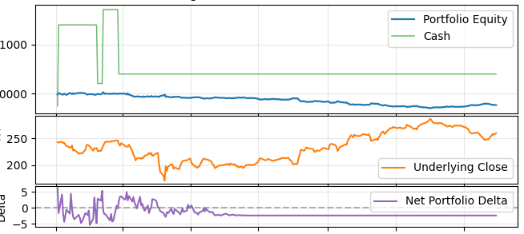

# Quant.py

## A backtesting Framework in Python

## Installation
Instal the required dependencies specified in `pyproject.toml`.
>Thus far one backtest is available, run it with: `$ make` from the root directory.

## Creating Backtests
This library contains all necessary tools to create your own backtests, just create a new backtest file, and run it however you want.

## Config
>NOTE: Not implemented
`config.py` contains all the configurable global variables. Feel free to add to these however you like.

## Stats
NOTE: Not implemented

